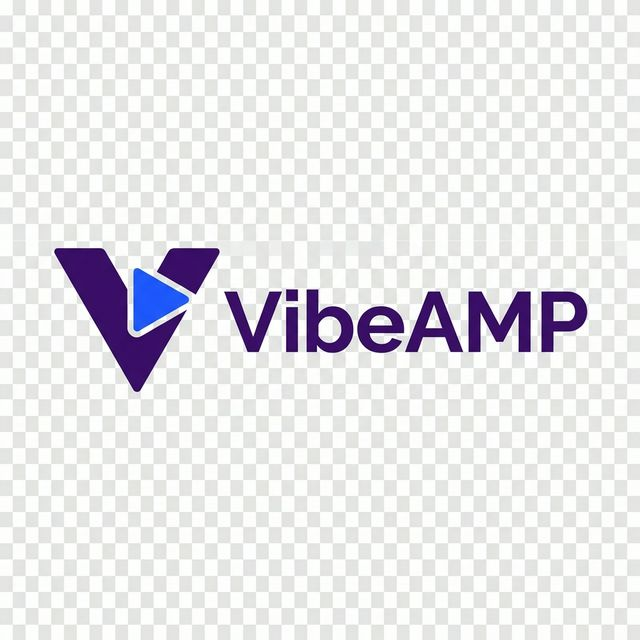

# VibeAmp 🎸

VibeAmp is a retro-styled YouTube music streamer and MP3 player built with Electron. It brings back the classic aesthetic of legendary media players like Winamp, combined with the modern power of YouTube streaming.



## ✨ Features

- **Retro Winamp Look**: A nostalgic user interface with a modern touch.
- **YouTube Streaming**: Search and play any song directly from YouTube.
- **Automatic Dependency Management**: No need to install `yt-dlp` or `ffmpeg` manually; the app handles it for you on first run.
- **Modular Windows**: Drag and position individual windows (Player, Playlist, Search, EQ, Album Art) anywhere on your screen.
- **Integrated Equalizer**: Fineset your audio with a built-in EQ.
- **Album Art**: High-quality album art display for the currently playing track.
- **Portable & Standalone**: `yt-dlp` is stored in the application user-data folder and FFmpeg is bundled with the app.

## 🚀 Getting Started

### Prerequisites

- [Node.js](https://nodejs.org/) (Version 16 or later recommended)
- `npm` (comes with Node.js)

### 📦 Automatic Dependencies

To provide a seamless experience, VibeAmp automatically manages its core multimedia dependencies on the first run. You do not need to install these manually.

- **yt-dlp**: Used for searching YouTube and fetching high-quality audio streams.
- **FFmpeg**: A platform-specific executable is bundled through `ffmpeg-static`.

#### Storage Location

These binaries are downloaded and stored in a persistent directory outside of the application folder to ensure stability:

- **Windows**: `%LOCALAPPDATA%\vibeamp-streamer` (preserved for compatibility with existing installations).
- **macOS**: VibeAmp's directory under `~/Library/Application Support`.

VibeAmp currently supports Windows and macOS. Linux is not configured as a build target.

### Installation

1. **Clone the repository:**

   ```bash
   git clone https://github.com/jsoriase/vibeamp.git
   cd vibeamp
   ```

2. **Install dependencies:**

   ```bash
   npm install
   ```

### Running the App

Start the application in development mode:

```bash
npm start
```

## 🛠️ Building for Production

Everything is already configured! To create a standalone executable for Windows or macOS, simply run the corresponding command:

### For Windows

```bash
npm run build:win
```

### For macOS

```bash
npm run build:mac
```

Architecture-specific builds are also available:

```bash
npm run build:mac:x64
npm run build:mac:arm64
```

> [!NOTE]
> Build each platform on that platform so `ffmpeg-static` installs the matching executable. Building for macOS requires a Mac and may require Xcode Command Line Tools (`xcode-select --install`). Public macOS distribution also requires Apple code signing and notarization.

## 📜 License

Created by chuchi. Licensed under [The Unlicense](LICENSE).
